Project 2
================
Nicole Levin, Shaoyu Wang
2022-10-11

# Introduction

This document is a vignette that describes pulling data from an API and
performing some exploratory data analysis based on those results. This
vignette will utilize the Spoonacular food API. More information about
this API can be found [here](https://spoonacular.com/food-api) In this
vignette, we will be building some functions to interact with the API
and doing some exploratory data analysis based on some example search
results.

# Required Packages

The following packages are required for interacting with the functions
in this vignette:  
\* httr  
\* dplyr  
\* jsonlite  
\* tidyverse

First, we will load the required packages

``` r
#Load libraries
library(httr)
library(dplyr)
library(jsonlite)
library(tidyverse)
```

# Building Search Functions

There are three functions that have been created to allow the user to
make a search from the API.

## `ingredient_search`

The first is called `ingredient_search` and it allows the user to select
an ingredient and a number of results to return. The function will then
provide an output data frame with many points of information for each of
the recipes. The function works by first searching for recipes with the
specified ingredient. The unique recipe ID numbers that the API uses for
identifying these recipes are then plugged into a second search to get a
combination of quantitative and categorical data including health
scores, aggregate likes, whether a dish is vegetarian, whether it is
gluten free, and a few others. The function takes two arguments, which
are: 1. `ingredient` - name of the ingredient 2. `number` - maximum
number of results to return Full search code is as follows:

``` r
#User options for search. Can input: (1)ingredient for search, (2)Number of results
ingredient_search <- function(ingredient, number=10){
  ingredient <- tolower(ingredient)
  search_url <- "https://spoonacular-recipe-food-nutrition-v1.p.rapidapi.com/recipes/findByIngredients"
  queryString <- list(
  ingredients = ingredient,
  number = number)
search_result <- VERB("GET", search_url, add_headers('X-RapidAPI-Key' = '73a2057416msh633772bf8275edfp1b3775jsn7e44cc5cb98d', 'X-RapidAPI-Host' = 'spoonacular-recipe-food-nutrition-v1.p.rapidapi.com'), query = queryString, content_type("application/octet-stream"))
  parsed_search_result <- fromJSON(rawToChar(search_result$content))
  id_list <- paste(as.character(parsed_search_result$id), collapse=",")
bulk_url <- "https://spoonacular-recipe-food-nutrition-v1.p.rapidapi.com/recipes/informationBulk"
queryString <- list(ids = id_list)
bulk_search <- VERB("GET", bulk_url, add_headers('X-RapidAPI-Key' = '73a2057416msh633772bf8275edfp1b3775jsn7e44cc5cb98d', 'X-RapidAPI-Host' = 'spoonacular-recipe-food-nutrition-v1.p.rapidapi.com'), query = queryString, content_type("application/octet-stream"))
  parsed_bulk_search <- fromJSON(rawToChar(bulk_search$content))
  results_df <- as_tibble(parsed_bulk_search) %>% select(id, title, glutenFree, dairyFree, vegetarian, aggregateLikes, healthScore, weightWatcherSmartPoints, sourceName, pricePerServing, readyInMinutes)
  combined_results <- results_df %>% mutate(WW_category = if_else(weightWatcherSmartPoints <10, 1, if_else(weightWatcherSmartPoints <20, 2, 3))) 
  factor(combined_results$WW_category, levels = c(1, 2, 3), labels = c("low", "medium", "high"))
return(combined_results)
}
#Run a test
ingredient_test <- ingredient_search(ingredient="cherry", number=50)
ingredient_test
```

    ## # A tibble: 50 × 12
    ##         id title      glutenFree dairyFree vegetarian aggregateLikes healthScore
    ##      <int> <chr>      <lgl>      <lgl>     <lgl>               <int>       <int>
    ##  1  799316 Black Che… TRUE       TRUE      FALSE                  10           0
    ##  2   50161 Jell-o Mo… TRUE       FALSE     TRUE                    1           2
    ##  3  779475 Black Che… TRUE       TRUE      TRUE                  167           0
    ##  4   50105 Cherry Mo… TRUE       TRUE      TRUE                   37           1
    ##  5   52755 Yellow Ch… TRUE       TRUE      TRUE                   26           2
    ##  6 1065961 Cherry Pr… TRUE       TRUE      TRUE                    1           7
    ##  7  405122 Bing Cher… TRUE       FALSE     TRUE                    0           2
    ##  8  525223 Dark Choc… FALSE      TRUE      FALSE               26141           3
    ##  9  524954 Root Beer… TRUE       TRUE      FALSE                2592           1
    ## 10  539027 Quick and… TRUE       FALSE     TRUE                 1491           5
    ## # … with 40 more rows, and 5 more variables: weightWatcherSmartPoints <int>,
    ## #   sourceName <chr>, pricePerServing <dbl>, readyInMinutes <int>,
    ## #   WW_category <dbl>

The example search results are for the ingredient “cherry with a maximum
number of results of 30. As the output shows, we can get a lot of
information from a simple search.

## `calorie_search`

The second function is called `calorie_search` and it allows the user to
select a minimum number of calories, maximum number of calories, whether
they want random results or ordered, and what number of results they
want. This function has default values for all variables, so they do not
all have to be specified for the search to execute. It works in a
similar fashion, where the initial query gets the list of ID numbers to
be used in a second query to get more data. In this case though, the
initial nutrition search based on calories gives us some output
variables like number of calories, grams of carbohydrates, grams of
protein, and grams of fat that we can bring into the final data set too.
This function takes in four arguments, which are, in order: 1.
`calories_from`: the minimum number of calories 2. `calories_to`: the
maximum number of calories 3. `number` - the maximum number of results
to return The full code of the function is as follows:

``` r
#This function is a search by calories. User options are (1)Minimum calories, (2)Maximum calories, (3)Whether we want a random set of results or the first ones alphabetically, and a number of results. All of these have defaults, so the user can specify nothing and still get a result.
calorie_search <- function(calories_from=0, calories_to=5000, number=10){
  calories_from <- as.character(calories_from)
  calories_to <- as.character(calories_to)
  number <- as.character(number)
  search_url <- "https://spoonacular-recipe-food-nutrition-v1.p.rapidapi.com/recipes/findByNutrients"
    queryString <- list(minCalories = calories_from, maxCalories = calories_to, number=number)
  search_result <- VERB("GET", search_url, add_headers('X-RapidAPI-Key' = '73a2057416msh633772bf8275edfp1b3775jsn7e44cc5cb98d', 'X-RapidAPI-Host' = 'spoonacular-recipe-food-nutrition-v1.p.rapidapi.com'), query = queryString, content_type("application/octet-stream"))
  parsed_search_result <- fromJSON(rawToChar(search_result$content))
  id_list <- paste(as.character(parsed_search_result$id), collapse=",")
  bulk_url <- "https://spoonacular-recipe-food-nutrition-v1.p.rapidapi.com/recipes/informationBulk"
queryString <- list(ids = id_list)
bulk_search <- VERB("GET", bulk_url, add_headers('X-RapidAPI-Key' = '73a2057416msh633772bf8275edfp1b3775jsn7e44cc5cb98d', 'X-RapidAPI-Host' = 'spoonacular-recipe-food-nutrition-v1.p.rapidapi.com'), query = queryString, content_type("application/octet-stream"))
  parsed_bulk_search <- fromJSON(rawToChar(bulk_search$content))
  results_df <- as_tibble(parsed_bulk_search) %>% select(id, title, glutenFree, dairyFree, vegetarian, aggregateLikes, healthScore, weightWatcherSmartPoints, sourceName, pricePerServing, readyInMinutes)
  results_df <- results_df %>% mutate(WW_category = if_else(weightWatcherSmartPoints <10, 1, if_else(weightWatcherSmartPoints <20, 2, 3))) 
  factor(results_df$WW_category, levels = c(1, 2, 3), labels = c("low", "medium", "high"))
  combined_results <- as_tibble(c(results_df, parsed_search_result[,3:8]))
  return(combined_results)
}
calorie_test <- calorie_search(calories_from= 100, calories_to = 500, number=50)
calorie_test
```

    ## # A tibble: 50 × 18
    ##        id title       glutenFree dairyFree vegetarian aggregateLikes healthScore
    ##     <int> <chr>       <lgl>      <lgl>     <lgl>               <int>       <int>
    ##  1  17281 Spicy Tuna… TRUE       TRUE      FALSE                   5          71
    ##  2  30338 Spanish-St… TRUE       TRUE      FALSE                   0         100
    ##  3  51843 Lemon-blue… FALSE      FALSE     TRUE                   25           2
    ##  4  58965 Mango & Ra… FALSE      FALSE     TRUE                   30           1
    ##  5  66226 Grapefruit… FALSE      FALSE     TRUE                    0           0
    ##  6  70450 Apple Pie … TRUE       FALSE     FALSE                 668           1
    ##  7  90629 Baked Appl… TRUE       FALSE     TRUE                    0           0
    ##  8  94853 Cantaloupe… TRUE       FALSE     TRUE                    0          22
    ##  9 105012 Grilled Zu… TRUE       FALSE     FALSE                   1          11
    ## 10 109236 Baby Artic… TRUE       TRUE      FALSE                   0           5
    ## # … with 40 more rows, and 11 more variables: weightWatcherSmartPoints <int>,
    ## #   sourceName <chr>, pricePerServing <dbl>, readyInMinutes <int>,
    ## #   WW_category <dbl>, image <chr>, imageType <chr>, calories <int>,
    ## #   protein <chr>, fat <chr>, carbs <chr>

The ingredient_search and calorie_search functions above output a
variable of “WW_category” This variable did not exist in the source data
and had to be created using the Weight Watchers Smart Points values. The
categories utilized are:

1.  Low: less than 10
2.  Medium: 10 to less than 20
3.  High: 20 or greater

“if_else” statements are used to create the new variable based on this
categorization.

## `search_by_2_nutrs`

The third function is called `search_by_2_nutrs`, and it allows the user
to search by two nutrients, minimum and maximum levels for both
nutrients, and a maximum number of results to return. The nutrient
options are grams of carbohydrates, grams of protein, and grams of fat.
This function takes in seven arguments, which are, in order: 1.
`first nutrient` - carbohydrates, protein, or fat 2. `first_from` -
minimum for first nutrient (in grams) 3. `first_to` - minimum for first
nutrient (in grams) 4. `sec_nutrient` - grams of carbohydrates, grams of
protein, or grams of fat 5. `sec_from` - minimum for second nutrient (in
grams) 6. `sec_to` - maximmum for second nutrient (in grams) 7. `number`
maximum number of results to return For example, if the user likes
fitness, this function can use to search the nutrients with low calories
but high protein. The full code of the function is as follows:

``` r
#This function searches based on minimum and maximum levels of two nutrients.
search_by_2_nutrs <- function(first_nutrient, first_from=0, first_to=5000, sec_nutrient, sec_from=0, sec_to=5000, number=10){
  base<-"https://api.spoonacular.com/recipes/findByNutrients"
  call2 <- paste(base,"?min",first_nutrient,"=",first_from,"&max",first_nutrient,"=", first_to,
                 "&min",sec_nutrient,"=",sec_from,"&max",sec_nutrient,"=", sec_to,
                 "&number=",number,"&apiKey=90c7af330c5f45a4a1b709068daed452",sep="")
  get_2_nutrs <- GET(call2)
  get_2_nutrs_text <- content(get_2_nutrs, "text")
  get_2_nutrs_json <- fromJSON(get_2_nutrs_text, flatten = TRUE)
  get_2_nutrs_tb <- as_tibble(get_2_nutrs_json) %>%
    select("id","title","calories","protein","fat","carbs")
  return(get_2_nutrs_tb)
}
```

# Exploratory Data Analysis

Now that we have set up our functions and run some test searches, we can
do some exploratory data analysis of the results. First, let’s look at
some contingency tables and bar plots of Weight Watcher points
categories, grouped by vegetarian to see if vegetarian results tend to
be lower point values.

``` r
#Create contingency table from calorie test results
table(calorie_test$WW_category, calorie_test$vegetarian, dnn=c("WW Category", "vegetarian"))
```

    ##            vegetarian
    ## WW Category FALSE TRUE
    ##           1    23   12
    ##           2     8    6
    ##           3     1    0

``` r
#Create contingency table for ingredient test results
table(ingredient_test$WW_category, ingredient_test$vegetarian, dnn=c("WW Category", "vegetarian"))
```

    ##            vegetarian
    ## WW Category FALSE TRUE
    ##           1    15   23
    ##           2     3    4
    ##           3     2    3

``` r
#Plot my tests as bar plots of Weight Watchers category grouped by vegetarian.
g <- ggplot(calorie_test, aes(x=WW_category))
g + geom_bar(aes(fill=vegetarian), position="dodge") +
  labs(title="Bar plot of WW Points for 100-500 Calorie Search", x="WW Smart Points Category")
```

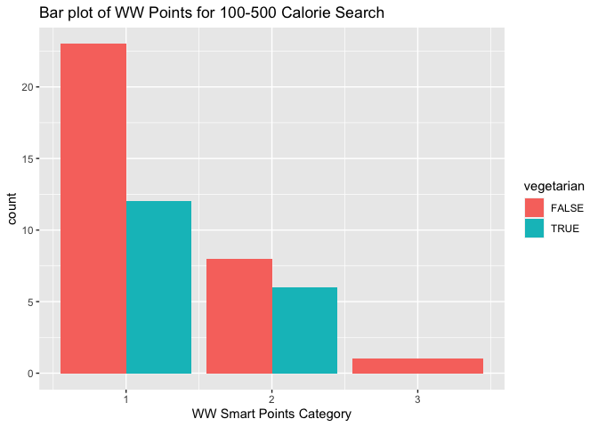<!-- -->

``` r
g <- ggplot(ingredient_test, aes(x=WW_category))
g + geom_bar(aes(fill=vegetarian), position="dodge") +
  labs(title="Bar plot of WW Points for Ingredient=Cherry", x="WW Smart Points Category")
```

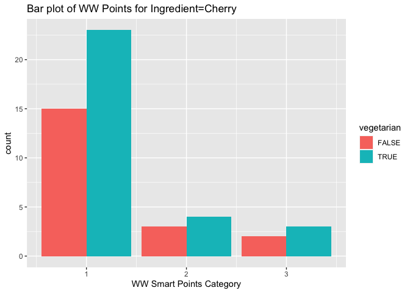<!-- -->

The most noticeable result here is that we get many more vegetarian
results with our fruit ingredient choice vs. a calorie-based search.

Next, let’s see if anything seems to trend with aggregate likes.
Possibly results with higher calories tend to get more likes since they
would tend to have more sugar or fat to make them taste good. Possibly
higher health scores tend to get more likes because of their perceived
health halo.

``` r
#Create scatterplots with aggregate likes as the response variable.
g <- ggplot(calorie_test, aes(x=calories, y=aggregateLikes))
g + geom_point() +
  labs(title="Aggregate Likes vs Calories from 100-500 Calorie Search Results", x="Calories", y="Aggregate Likes")
```

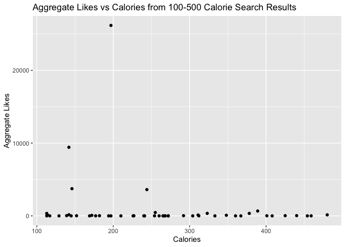<!-- -->

``` r
g <- ggplot(ingredient_test, aes(x=healthScore, y=aggregateLikes))
g + geom_point() + 
  labs(title="Aggregate Likes vs Calories from Cherry Ingredient Search Results", x="Health Score", y="Aggregate Likes")
```

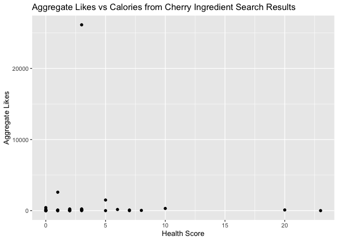<!-- -->

The most notable result in these plots is that not very many of these
recipes get very many likes. There are a few clear outliers with many
more likes than the rest.

We are now interested in looking at whether there is a difference in the
spread of health score results for vegetarian and non-vegetarian recipes
utilizing some box plots.

``` r
#Next box plot of calories or health score broken out by vegetarian and not
g <- ggplot(calorie_test, aes(x=vegetarian, y=calories))
g + geom_boxplot()+
  labs(title =  "Boxplot of calories for 100-500 calorie search")
```

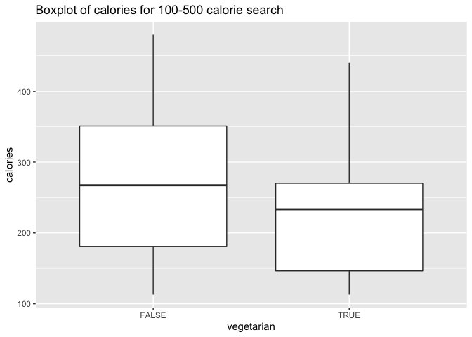<!-- -->

``` r
g <- ggplot(ingredient_test, aes(x=vegetarian, y=healthScore))
g + geom_boxplot() + 
  labs(title =  "Boxplot of health scores for cherry ingredient search")
```

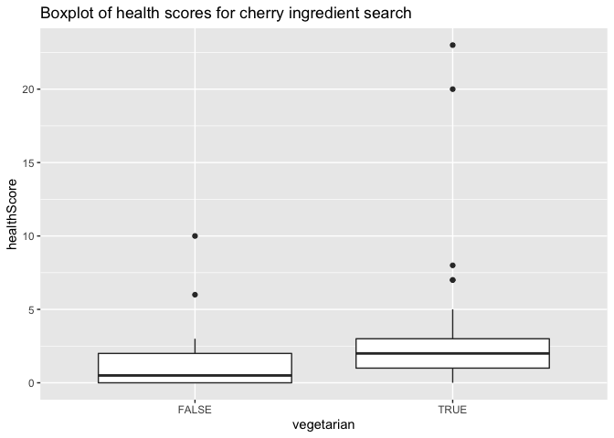<!-- -->

The plots show a smaller spread of the calorie results for vegetarian
recipes and some high outliers in the health scores for some of the
vegetarian results with cherry as an ingredient.

One more thing that we could look at are the histogram distributions of
calories for the calorie search and health score for the ingredient
search results to see if any interesting distributions arise.

``` r
#Histogram for calories based on results from the calorie search
g <- ggplot(calorie_test, aes(x=calories))
g + geom_histogram(bins=10, color = "black", fill = "lightblue",
size = 1) + 
  labs(title="Histogram of calories for recipes from 100-500 calories")
```

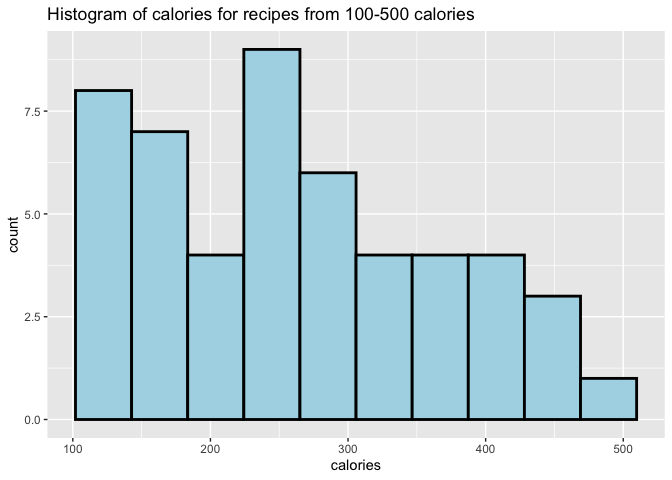<!-- -->

``` r
#Histogram for health score based on results from the ingredient search
g <- ggplot(ingredient_test, aes(x=healthScore))
g + geom_histogram(bins=10, color = "black", fill = "lightblue",
size = 1) + 
  labs(title="Histogram of health scores for recipes with cherry as an ingredient")
```

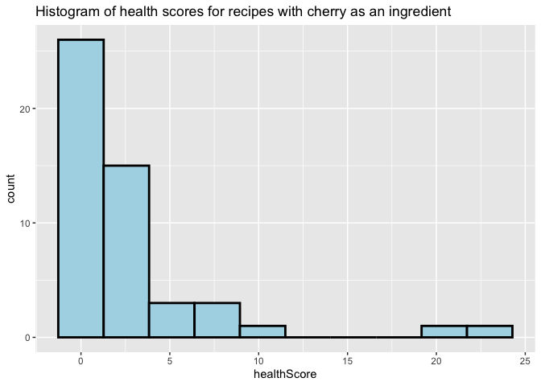<!-- -->

The histograms show the results are skewed to the right in both
distributions with peaks at relatively low numbers of calories and
health scores.

Moreover, we can search any two nutrients from calories, protein, fat,
and carbohydrates, to see what recipes what we would like to choose.
Let’s say we are fitness enthusiasts, and we hope to select food that is
low in calories but high in protein. We can search for a calorie range
of 0-1500 and a protein range of 30-100. The full code using
`search_by_2_nutrs` is as follows:

``` r
cal_prot_test <- search_by_2_nutrs(first_nutrient="Calories", first_from=0, first_to=1500,
                                  sec_nutrient="Protein", sec_from=30, sec_to=100, number=100)
```

    ## No encoding supplied: defaulting to UTF-8.

``` r
cal_prot_test$protein <- as.numeric(substr(cal_prot_test$protein,1, nchar(cal_prot_test$protein)-1))
cal_prot_test$fat <- as.numeric(substr(cal_prot_test$fat,1, nchar(cal_prot_test$fat)-1))
cal_prot_test$carbs <- as.numeric(substr(cal_prot_test$carbs,1, nchar(cal_prot_test$carbs)-1))
cal_prot_test
```

    ## # A tibble: 100 × 6
    ##        id title                                     calories protein   fat carbs
    ##     <int> <chr>                                        <int>   <dbl> <dbl> <dbl>
    ##  1  32579 Tuna Spaghetti With Fava Beans                 721      44    28    78
    ##  2 511728 Pasta Margherita                               809      34    34    90
    ##  3 631754 Lemony Zucchini Fritters                       473      30    24    36
    ##  4 631912 A Post Thanksgiving “sopa De Tortilla”         444      36    26    19
    ##  5 632300 Amazing Chicken Burgers                        361      32    18    17
    ##  6 632822 Asian Coleslaw with Baked Salmon               508      40    27    32
    ##  7 633088 Authentic Jamaican Curry Chicken               547      69    19    25
    ##  8 633352 Bacon Wrapped Tofu Tacos                       580      30    36    33
    ##  9 633624 Baked Fried Chicken With Cauliflower Mash      662      66    29    33
    ## 10 633754 Baked Ratatouille                             1028      32    69    82
    ## # … with 90 more rows

Let’s use scatter plots to see the relationship between calories and
fat, calories and carbohydrates.

``` r
g <- ggplot(cal_prot_test, aes(x = fat, y = calories))
g + geom_point() + geom_smooth(method = lm, col = "Red") +
  labs(title = "Scatter plot of calories vs fat")
```

    ## `geom_smooth()` using formula 'y ~ x'

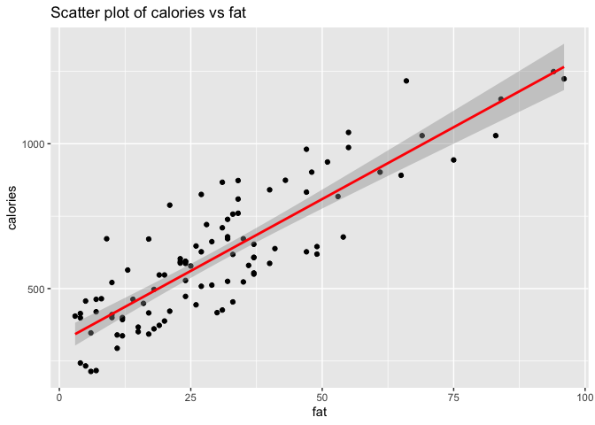<!-- -->

``` r
g <- ggplot(cal_prot_test, aes(x = carbs, y = calories))
g + geom_point() + geom_smooth(method = lm, col = "Red") +
  labs(title = "Scatter plot of calories vs carbohydrates")
```

    ## `geom_smooth()` using formula 'y ~ x'

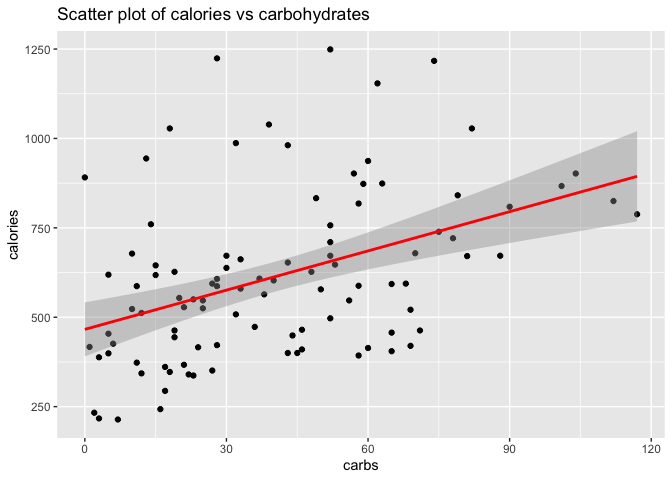<!-- -->

According to the plots above, we can see that the calories vs. fat has a
stronger slope than calories vs. carbohydrates. Therefore, fat has more
effect on calories than carbohydrates.

We can continue to evaluate calories, fat, carbohydrates to see if there
are interesting finds. Let’s compare fat to carbohydrates, in order to
choose food based on fat and carbohydrate levels. First, we’ll add a new
output variable `calories_level`. This variable did not exist in the
source data and had to be created using the values of calories. The
categories utilized are:

1.  Low: less than 400
2.  Medium: 400 to less than 800
3.  High: greater than 800

``` r
cal_prot_test <- cal_prot_test %>% 
  arrange(calories) %>% 
  mutate(calorie_level = ifelse(cal_prot_test$calories >= 800, "3",
                              ifelse(cal_prot_test$calories >= 400, "2",
                                     ifelse(cal_prot_test$calories >= 0, "1"))),
         calorie_level = factor(calorie_level,
                              level = c(1,2,3),
                              labels = c("low","medium","high")))

cal_prot_test <- cal_prot_test %>% select(calorie_level, calories, protein, fat, carbs, title)
cal_prot_test
```

    ## # A tibble: 100 × 6
    ##    calorie_level calories protein   fat carbs title                             
    ##    <fct>            <int>   <dbl> <dbl> <dbl> <chr>                             
    ##  1 medium             214      32     6     7 Steamed Plaice & Spinach Rolls    
    ##  2 high               217      32     7     3 Mahi-Mahi With Lemon Caper Sauce  
    ##  3 medium             233      44     5     2 Steamed Halibut                   
    ##  4 medium             243      33     4    16 Brined Chicken Breast with Sautée…
    ##  5 low                294      30    11    17 Grilled Buffalo Chicken Wraps     
    ##  6 medium             337      36    12    23 Spice-Rubbed Lemon Barbecue Salmon
    ##  7 medium             340      38    11    22 Thai Street Vendor Salmon Skewers 
    ##  8 medium             343      36    17    12 Blood Orange Sesame Salmon        
    ##  9 medium             347      52     6    18 Chicken Fingers                   
    ## 10 high               351      31    15    27 Gluten Free Dairy Free Sugar Free…
    ## # … with 90 more rows

Secondly, we’ll add other two output variables `fat_level` and
`carbs_level`. Both `fat_level` and `carbs_level` categories utilized
are:

1.  Low: less than 40
2.  Medium: 40 to less than 80
3.  High: greater than 80

``` r
cal_prot_test <- cal_prot_test %>% arrange(fat) %>% 
  mutate(fat_level = ifelse(cal_prot_test$fat >= 80, "3",
                            ifelse(cal_prot_test$fat >= 40,"2",
                                   ifelse(cal_prot_test$fat >= 0, "1"))),
         fat_level = factor(fat_level,
                            level = c(1,2,3),
                            labels = c("low","medium","high")))

cal_prot_test <- cal_prot_test %>% arrange(carbs) %>%          
  mutate(carb_level = ifelse(cal_prot_test$carbs >= 80, "3",
                              ifelse(cal_prot_test$carbs >= 40, "2",
                                     ifelse(cal_prot_test$carbs >= 0, "1"))),
         carb_level = factor(carb_level,
                              level = c(1,2,3),
                              labels = c("low","medium","high")))

cal_prot_test <- cal_prot_test %>% 
  select(calorie_level, calories, fat_level, fat, carb_level, carbs, protein, title)
cal_prot_test
```

    ## # A tibble: 100 × 8
    ##    calorie_level calories fat_level   fat carb_level carbs protein title        
    ##    <fct>            <int> <fct>     <dbl> <fct>      <dbl>   <dbl> <chr>        
    ##  1 medium             891 medium       65 medium         0      71 Instant Pot …
    ##  2 high               417 low          30 low            1      35 Cheese Pork …
    ##  3 medium             233 low           5 low            2      44 Steamed Hali…
    ##  4 high               217 low           7 medium         3      32 Mahi-Mahi Wi…
    ##  5 low                388 low          20 low            3      48 Grilled Lemo…
    ##  6 low                399 low           4 medium         5      81 Super Easy O…
    ##  7 medium             454 medium       33 low            5      33 Fragrant Cur…
    ##  8 medium             619 low          49 low            5      35 Pan-Roasted …
    ##  9 medium             426 low          31 low            6      31 Easy Slow Co…
    ## 10 medium             214 low           6 medium         7      32 Steamed Plai…
    ## # … with 90 more rows

Now, let’s use the contigency tables and bar plots to check the results.

``` r
table(cal_prot_test$calorie_level, cal_prot_test$fat_level, dnn=c("calorie_level", "fat_level"))
```

    ##              fat_level
    ## calorie_level low medium high
    ##        low     11      4    1
    ##        medium  45     15    2
    ##        high    20      1    1

``` r
table(cal_prot_test$calorie_level, cal_prot_test$carb_level, dnn=c("calorie_level", "carb_level"))
```

    ##              carb_level
    ## calorie_level low medium high
    ##        low      7      8    1
    ##        medium  32     24    6
    ##        high    14      7    1

Through the tables, we can conclude that medium calorie level with low
fat level have the most recipe options from our search, and medium
calorie level with low carbohydrate level have the most recipes options
from our search. In total, medium calorie level with low fat level have
the most recipes.

``` r
g <- ggplot(cal_prot_test, aes(x = fat_level))
g + geom_bar(aes(fill = calorie_level), position = "dodge") +
  labs(title = "Bar plot of calorie_level vs fat_level")
```

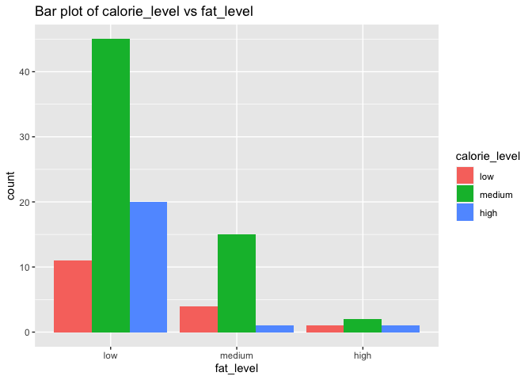<!-- -->

``` r
g <- ggplot(cal_prot_test, aes(x = carb_level))
g + geom_bar(aes(fill = calorie_level), position = "dodge") +
  labs(title = "Bar plot of calorie_level vs carb_level")
```

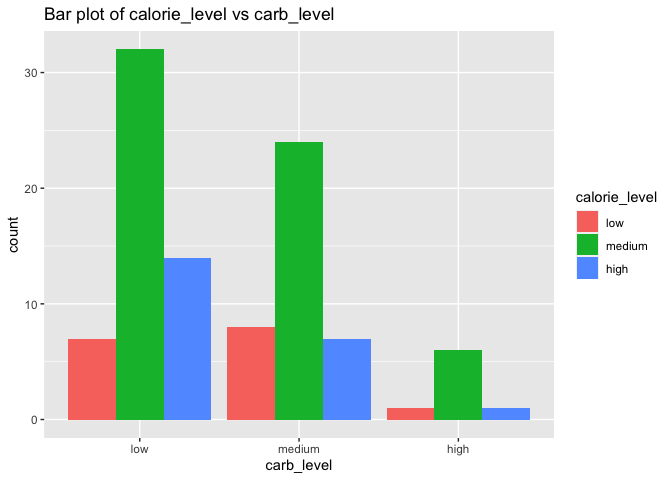<!-- -->

From the bar plots above, we can find that for calorie level vs fat
level, as fat is increasing, counts for all three calorie levels are
decreasing. For calorie level vs carbohydrate level, as the carbohydrate
level increases, the counts for medium and high calorie levels are
decreasing, but the counts for low calorie level increase when moving
from low carbohydrate level to medium carbohydrate level and then
decrease from medium carbohydrate level to high carbohydrate level.

# Conclusion

We hope that this vignette has given you some insight into working with
APIs. In summary, what we did throughout this vignette was build some
functions to allow for some flexible user defined searches, ran a few
example searches, and did some exploratory data analysis with the
results of those searches. Once the functions are built, there is nearly
endless data that can be explored. Happy searching!
